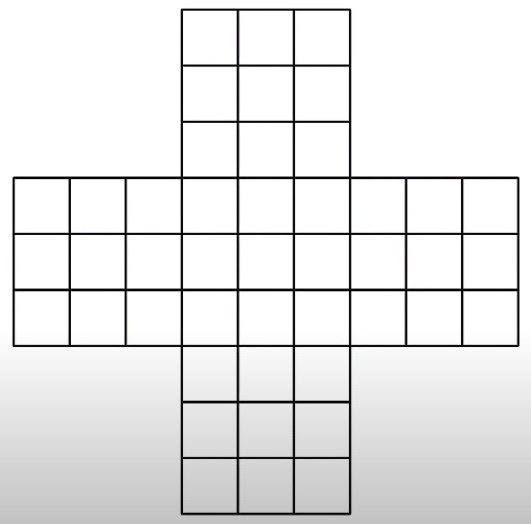
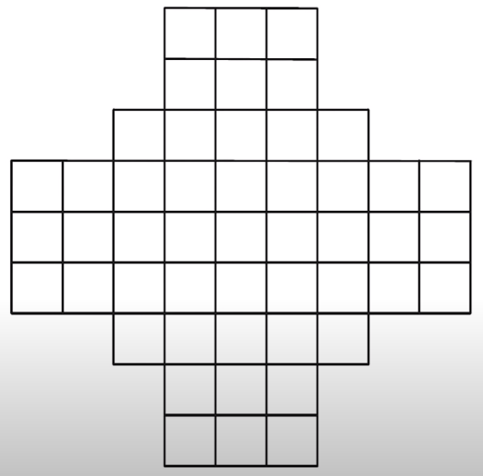
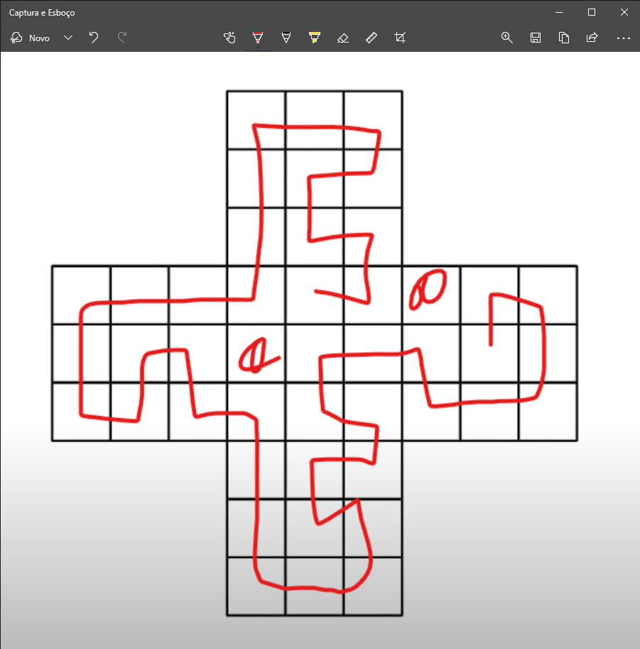
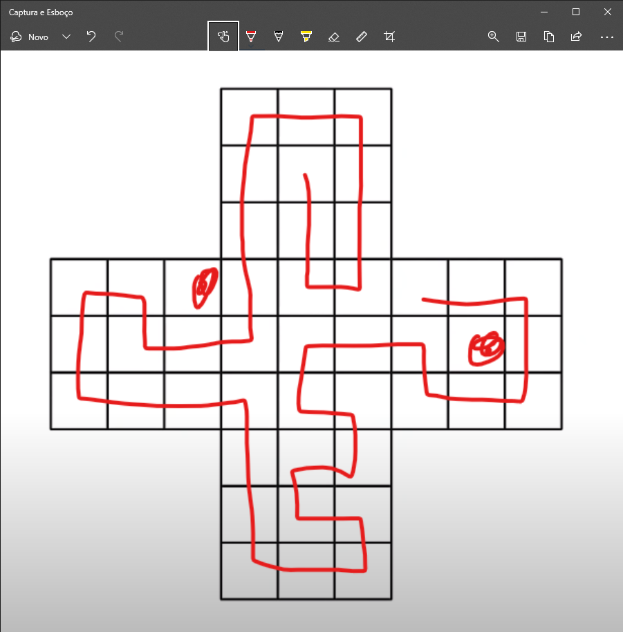
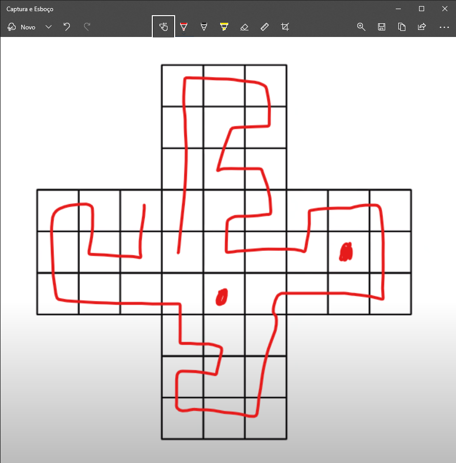
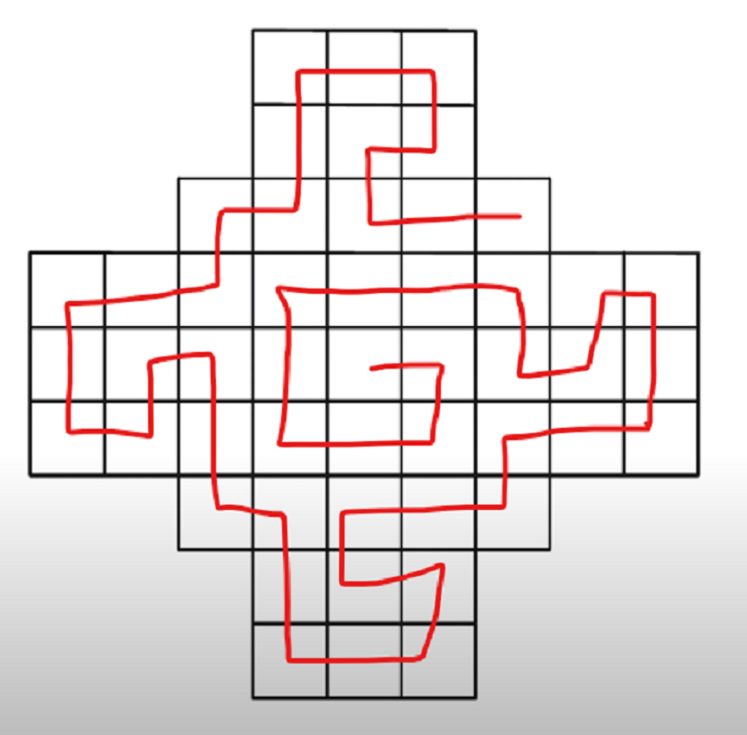
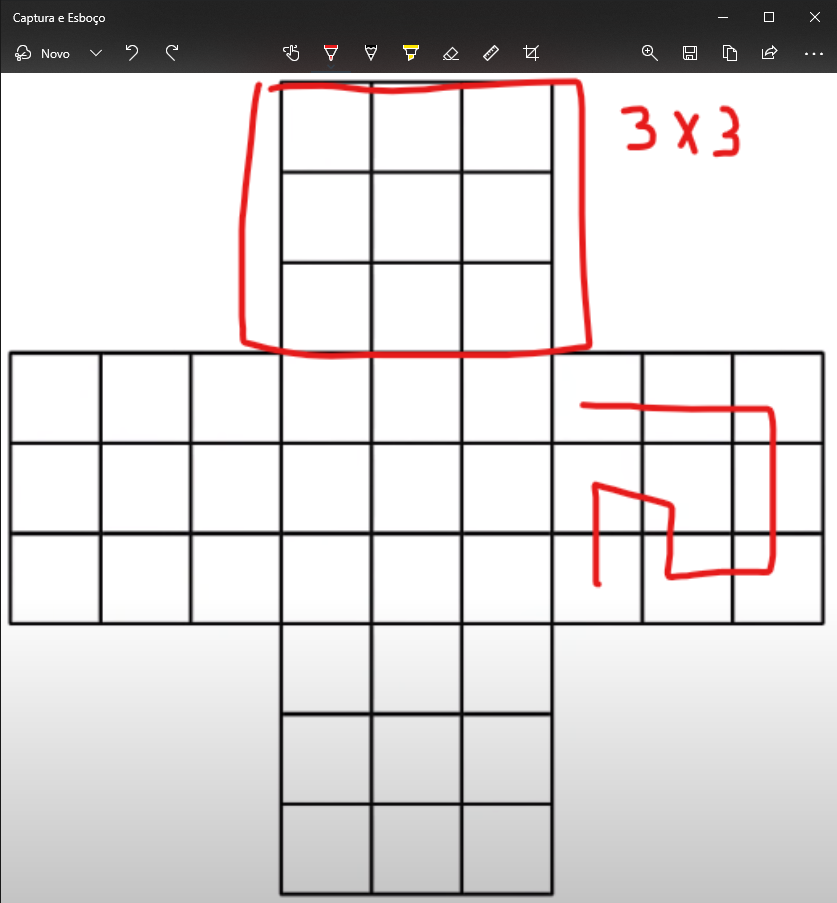
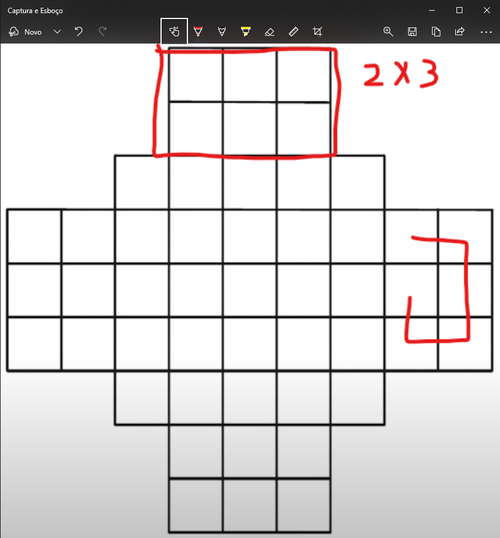
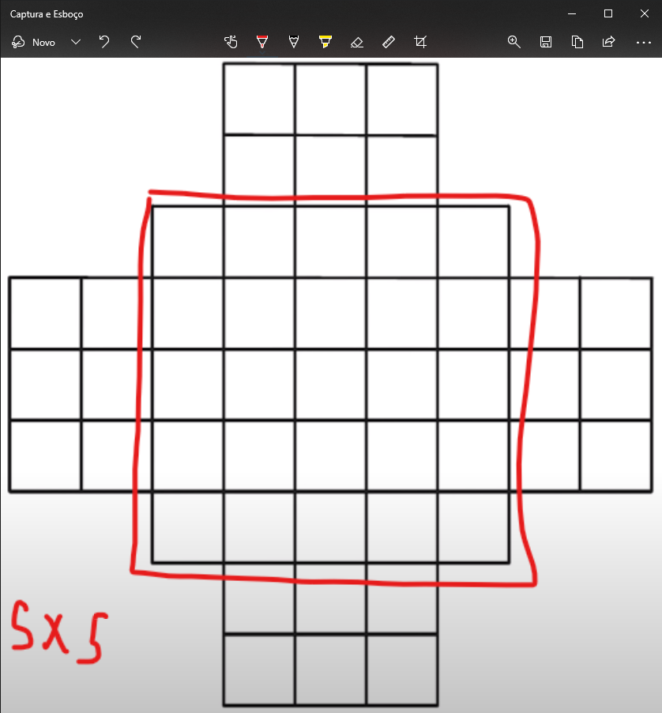
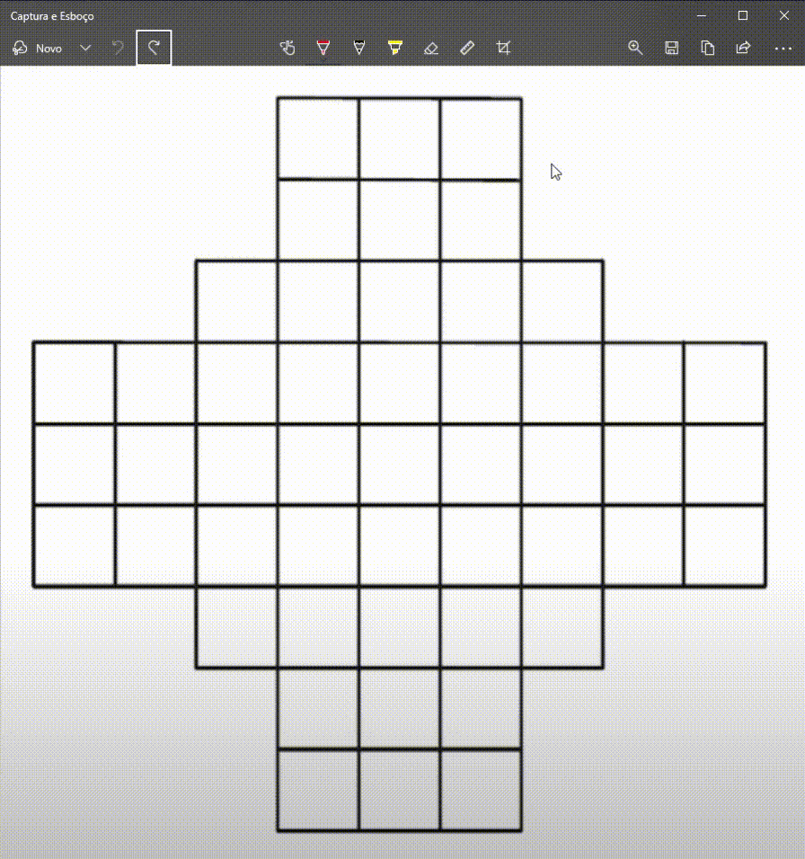

# Desafio 2

O desafio consistem em traçar uma linha sobre os quadrados das figuras na vertical ou na horizontal, de uma forma que, todos os quadrados sejam traçados, mas apenas uma vez.

Essas são as duas figuras apresentadas:

| Figura 1 | Figura 2 |
|:--------:|:--------:|
|||

---

## Tentativas
Considerando as regras, eu começei a pensar em como eu poderia solucionar o desafio.

### Figura 1

| 1º Tentativa | 2º Tentativa | 3º Tentativa|
|:------------:|:------------:|:-----------:|
||||

Eu tentei diversas vezes, e não consegui solucionar a primeira figura. Em qualquer tentativa, sempre sobra dois quadrados.

### Figura 2

| Tentativa |
|:---------:|
||

Já a segunda figura, foi possível solucionar.

---

## Justificativa
O que será que faz com que a **primeira** figura seja impossível, e a **segunda** seja possível de solucionar?

A **primeira** figura é composta por **5** blocos **ímpares** (**3x3**).

| 5 impares |
|:---------:|
||

Já a segunda figura é composta por **4** blocos **pares** (**2x3**), e **1** bloco **impar** (**5x5**).

| 4 pares | 1 impar |
|:-------:|:-------:|
|||

---

## Conclusão
Toda vez que a figura for composta por **1** ou **mais** blocos **impares**, a solução se torna impossível.

